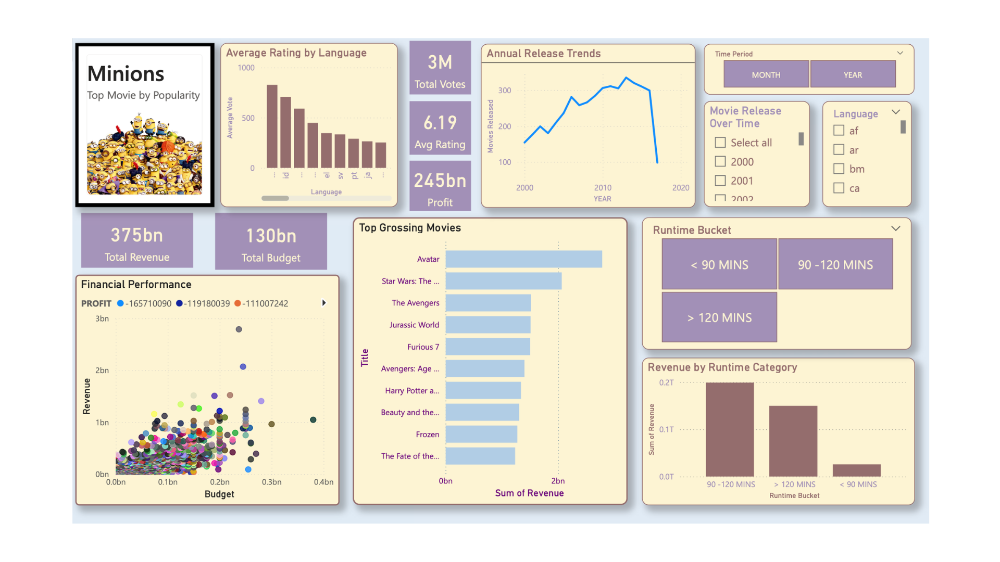

# 🎬 Movie Box Office & Financial Performance Analytics

Welcome to my data analytics portfolio project! This project explores a comprehensive movie dataset to analyze box office performance, financial returns (budget vs. revenue vs. profit), runtime categories, and global audience trends.

## 🛠️ Tools & Technologies Used

* **Excel:** Data cleaning, missing value checks, calculated profit columns, and structured pivot tables (`CLEAN_Movie_DB` and `Pivot Analysis` sheets).
* **Power BI:** Designing an interactive executive dashboard for visual financial and trend storytelling.

## 🧹 Data Cleaning & Preparation

To maintain high data integrity and prevent unnecessary information loss across thousands of film records:
* **Missing Value Auditing:** Inspected missing financial and metadata entries across records.
* **Calculated Metrics:** Engineered a dedicated **Profit** metric (`Revenue - Budget`) to accurately evaluate financial success alongside gross revenue and budgets.
* **Runtime Bucketing:** Segmented film lengths into distinct duration buckets (`< 90 mins`, `90-120 mins`, and `> 120 mins`) to evaluate how runtime impacts total revenue generation.

## 📊 Key Dashboard Insights & Features

* **Financial Performance & ROI:** Evaluated correlations between production budgets and gross box office revenues using scatter plots and trend metrics, highlighting top-grossing blockbusters like *Avatar*, *Star Wars*, and *The Avengers*.
* **Annual Release Trends:** Tracked movie production volume growth and shifts over release years.
* **Runtime Category Analysis:** Analyzed which movie length categories capture the highest share of total revenue.
* **Language & Rating Breakdown:** Examined average user ratings across primary original languages and popularity metrics.

## 📸 Dashboard Preview

## 📁 Repository Structure

* `TorresRickin_Movies_data_2000.xlsx` : Contains the full multi-sheet workbook including raw data logs, data cleaning drafts, pivot analysis, and clean datasets.
* `Dashboard_Snapshot.png` : A clean visual preview of the Power BI executive dashboard.

---
*Created by Rickin Torres*
